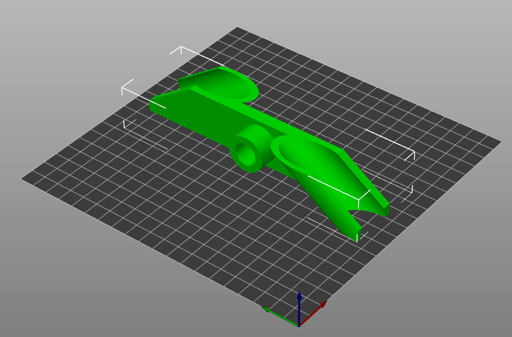
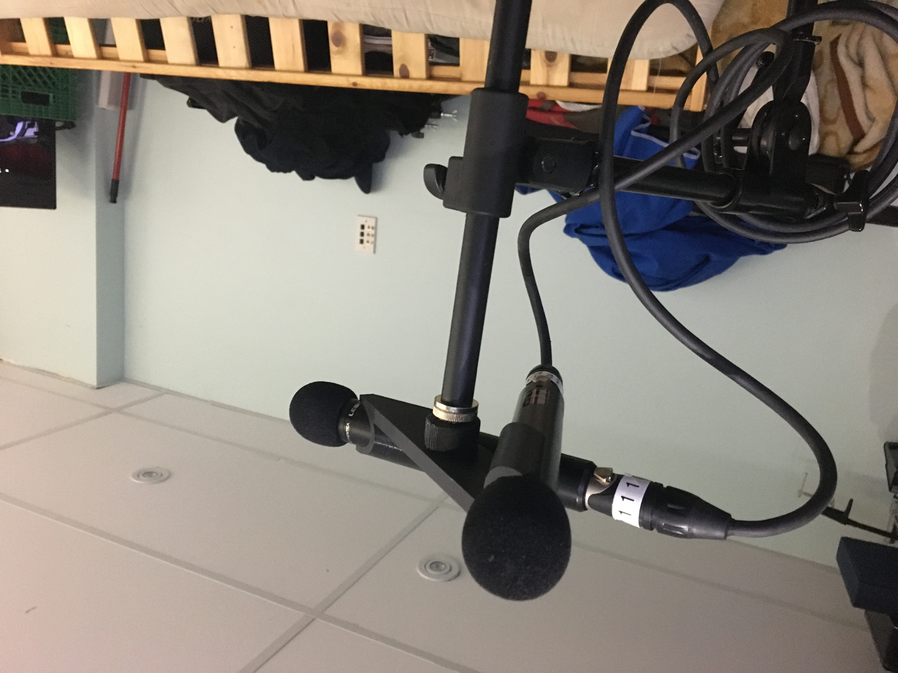
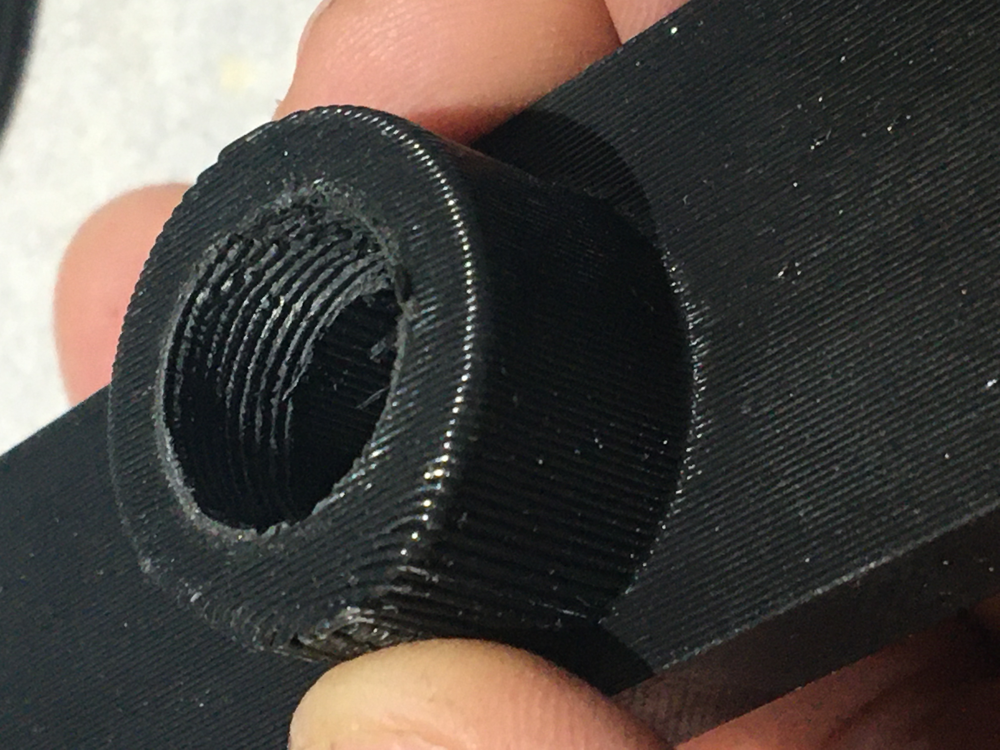

# An ORTF clip for Lewitt style microphones

A clip for [The ORTF stereo technique] with Lewitt style condenser microphones.

This should work for their 24.5 mm diameter pencil condenser microphones

* LCT 040
* LCT 140
* LCT 340

## V1.0 (June 3, 2021)

I measured the microphones I had with calipers and threw a dart to guess how thick the material should be

I created this using OpenSCAD.

Here I sort of just designed a microphone model. Then made two microphones oriented in their position.
and then, I dumbly iterated editing a cylinder with a difference of the microphone body.
Then added a cube in the middle as the beam.
And then kept editing and adjusting things until it "looked ok" on the screen. Then export a STL.

> I know there are better ways to do this. I might even clean this up someday. I just wanted to prototype this for now.

I found a friend who had a 3D resin printer. And got them to build this for me!

This worked out unbelievably well. The model was designed with "zero tollerances" (to the size of the microphones). I was expecting there to be a little bit of variance in the inner size of the clamp if I was to FDM print this. So then having to file it, or iterate it to get the size right. But here, the size seems to grip the microphones well enough.

Feedback:

* The resin is sort of brittle and less forgiving (to dropping) than FDM print would be.
* The sharp edges are sort of hard to get nice looking. I should update the flat faces on the edge of the clip to be a bit rounded.
* I should add a fillett on the inside of the beam where it attaches to the clip part, to provide additional durability.
*Adding a round post that can be threaded with the standard wide microphone screw would be neat.

## V1.1 (June 17, 2021)

I ended up dropping the V1.0 model when attaching it to a mic stand. It shattered into several pieces.

I guess resin printing is sort of brittle like that. And that I need to make the bits a little more thicker to not be so delicate.

This edition

* Make the beam between the clip parts thicker and taller
* Make the clip profile at the top flush with the top of the beam.
* Make the clips extend down all the way to the bottom. So it is easier to print this.
* Experiment with adding a cylinder in the middle for mounting onto a microphone stand.

(Update: July 19, 2021)

I got this design printed.

It feels nice and springy, but not brittle too. Which is important, as I tend to drop things a lot.

The spot for the threads works well too.

I used a lighter to heat up the metal end of a mic stand and then turned that into the plastic. It took a couple attempts as it kept cooling down on me. But this clip now reliably threads onto a regular microphone stand.

## License

These cad files are licensed using MIT license.

I designed these to solve my specific problem, of wanting I want these to be useful

